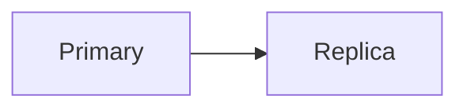

# Frane Jelavic

Source for [franejelavic.github.io](https://franejelavic.github.io/), a small personal site built with Hugo and no third-party theme.

## Requirements

- Hugo `0.164.0` (the standard edition is sufficient)
- Make and a POSIX-like shell for the convenience commands

The normal build does not require Node, Python, Docker, a package manager, or a theme submodule. The site and build timezone is `Europe/Zagreb`.

### Install the pinned Hugo version on macOS

Download the standard `hugo_0.164.0_darwin-universal.pkg` and `hugo_0.164.0_checksums.txt` files from the [official Hugo 0.164.0 release](https://github.com/gohugoio/hugo/releases/tag/v0.164.0). Verify the package before installing it:

```sh
grep '  hugo_0.164.0_darwin-universal.pkg$' hugo_0.164.0_checksums.txt | shasum -a 256 -c -
sudo installer -pkg hugo_0.164.0_darwin-universal.pkg -target /
hugo version
```

The last command must report `v0.164.0`. The local version gate also accepts official build suffixes after that exact version, such as a `-<commit>` suffix or `+extended+withdeploy`; it rejects every other Hugo version. Other platforms can use the matching standard archive from the same release and verify it against the published checksum file.

## Local workflow

Preview only content eligible for publication:

```sh
make serve
```

Preview drafts as well:

```sh
make serve-drafts
```

Both previews are development builds, so they do not load GoatCounter. Stop either server with `Ctrl-C`.

Run the same production and draft acceptance checks used in CI:

```sh
make check
```

`make check` first enforces repository hygiene for tracked generated output, lock and credential files, private paths, contact addresses, employment-profile language, and misplaced validation fixtures. It then verifies real production/draft/development builds plus fixed-clock zero-post and populated scenarios, technical-writing features, visibility controls, archetype defaults, canonical URLs, and environment-specific analytics. Scenario content stays under `testdata/` and temporary build directories; it is never published.

CI adds workflow linting with pinned `actionlint` and an offline, fragment-aware generated-link check with pinned `lychee`. Hugo, actionlint, and lychee are installed only in the runner's temporary directory from checksum-verified release archives.

Build the production site into `public/` or include drafts in a local production-mode build:

```sh
make build
make build-drafts
```

Production-mode output includes GoatCounter by design. Generated files in `public/` are ignored and must not be committed.

## Create and publish a post

Create a leaf page bundle with a lowercase, hyphenated slug:

```sh
make new SLUG=understanding-replication-lag
```

This creates `content/writing/understanding-replication-lag/index.md` from `archetypes/writing.md`. Keep diagrams and other article media beside `index.md`, then reference them with relative Markdown paths such as:

```md

```

Complete the title, description, and date in the generated front matter. Use categories for a post's broad area and tags for specific technologies or concepts. Both should describe the finished article rather than define topics in advance.

Set `toc: true` when a longer article benefits from a table of contents. Mermaid is opt-in per diagram:

````md

````

The Mermaid bundle is self-hosted and loads only on a page that contains a Mermaid fence.

New posts start with `draft: true`. Use `make serve-drafts` while writing and run `make check` before publication. To publish, set `draft: false`, commit the bundle, and preferably open a pull request so validation completes before merging to `main`. A deliberate direct push to `main` still runs the same acceptance, workflow, and offline-link validation before any Pages artifact can be built or uploaded.

Confirm publication in the repository's [Deploy Hugo site to Pages workflow](https://github.com/FraneJelavic/FraneJelavic.github.io/actions/workflows/deploy.yml): wait for validation, build, and deployment to pass, then open the article on the production site. If a job fails, use its first failing step together with the recovery guidance below.

## Analytics and deployment

GoatCounter loads only when Hugo builds with the `production` environment. Local `make serve` and `make serve-drafts` previews never send page views. Production traffic can be reviewed at [franejelavic.goatcounter.com](https://franejelavic.goatcounter.com/).

Pull requests run `.github/workflows/check.yml` with read-only repository permission and no deployment steps. Pushes to `main` run `.github/workflows/deploy.yml`, whose read-only validation job must pass before the separately permissioned Pages build can upload an artifact; deployment remains a third job. Manual deployment fails immediately unless it targets `main`. GitHub Pages uses the Actions source; there is no `gh-pages` branch.

### Common recovery steps

- If a check reports the wrong Hugo version, install `0.164.0` and confirm with `hugo version`.
- If repository policy fails, use the reported path and contract to remove generated output, private/contact data, credential material, or misplaced fixtures; the check does not inspect or rewrite Git history.
- If a deterministic fixture check fails, use the reported scenario, generated page, and contract. Keep fixtures under `testdata/verify-build/` and do not copy them into `content/`.
- If Hugo reports a warning, fix the reported content or template issue; warnings intentionally fail checks and deployment.
- If a draft is missing from preview, use `make serve-drafts` and confirm its front matter contains `draft: true`.
- If generated output looks stale, stop the server, remove the ignored `public/` directory, and rerun the relevant command.
- If workflow linting or offline link validation fails, fix the reported workflow, route, asset, feed, or fragment and rerun `make check` before pushing.
- If deployment fails, open the failed GitHub Actions run and identify whether validation, Pages build, or deployment failed; fix the first failing step, run `make check`, and push the correction.
- If GoatCounter is absent locally, no recovery is needed; analytics is intentionally production-only.

## Future changes

A custom domain requires DNS records and GitHub Pages configuration, plus the appropriate production `baseURL`; it does not require restructuring the site. Search, comments, math rendering, and code-copy controls can likewise be added later as independent enhancements.

## Licensing

Site templates, styles, scripts, and configuration are available under the [MIT License](LICENSE). Files under `content/` and original article media are excluded from that grant; see [CONTENT_LICENSE.md](CONTENT_LICENSE.md).
