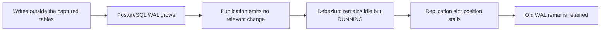
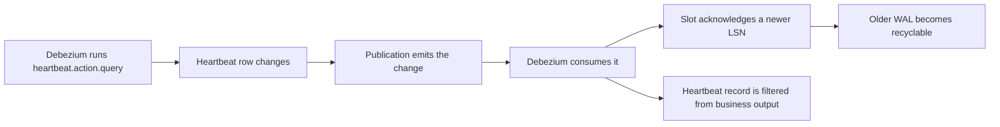

+++
title = 'When Debezium Does Not Advance a PostgreSQL Replication Slot'
date = '2026-08-26T07:30:00+02:00'
lastmod = '2026-08-26T07:30:00+02:00'
draft = false
description = 'Why quiet captured tables can pin PostgreSQL WAL while Debezium is running, and how a source heartbeat moves the replication slot forward.'
categories = ['Distributed Systems']
tags = ['Debezium', 'PostgreSQL', 'Kafka Connect', 'CDC']
toc = true
+++

A Debezium connector can be `RUNNING` while its PostgreSQL replication slot retains gigabytes of WAL. Nothing has crashed. Kafka may be healthy. The captured tables may be fully up to date. PostgreSQL can still run out of disk.

The uncomfortable part is that Debezium is not always an adequate consumer for PostgreSQL's WAL retention contract. Debezium wants changes from selected tables. PostgreSQL needs a consumer to confirm progress through the WAL. Those are different jobs.

When the selected tables are quiet, Debezium may have nothing to consume and no newer log sequence number to acknowledge. A source heartbeat fixes that by writing a change which exists only to move the replication slot forward.

## The connector is selective, the WAL is not

PostgreSQL writes changes to its write-ahead log, or WAL, before it writes modified data pages. An LSN identifies a position in that log.

A logical replication slot protects WAL which its consumer may still need. PostgreSQL records the consumer's progress in `confirmed_flush_lsn`, while `restart_lsn` marks the oldest WAL the slot might still require. WAL before the restart position can eventually be recycled.

Debezium does not consume every database change as a business event. With the `pgoutput` plug-in, a publication selects which table changes enter the logical replication stream. Debezium can apply its own table filters as well.

WAL is shared by every database in a PostgreSQL instance, while a logical replication slot belongs to one database. A busy database can therefore move the instance's current LSN while a slot attached to a quiet database receives nothing it can confirm.

That selectivity is useful until the workload looks like this:

- PostgreSQL receives sustained writes.
- Most writes affect another database or tables outside Debezium's publication.
- The captured tables receive few or no changes.
- Debezium stays connected and reports `RUNNING`.

The PostgreSQL instance keeps generating WAL, but the slot has no relevant logical record to send to Debezium. Its confirmed position may stop moving. PostgreSQL retains WAL behind the slot even though Debezium has no business event to process.

This is not connector lag in the usual sense. There may be no captured event waiting for Debezium. It is a mismatch between a filtered change stream and PostgreSQL's need for an acknowledged WAL position.



## When a normal Debezium heartbeat is not enough

`heartbeat.interval.ms` tells Debezium to emit periodic heartbeat records. These records are useful for proving that the connector is alive and for carrying the latest source position which Debezium has observed.

But a connector-side heartbeat does not create a PostgreSQL WAL record. If no relevant source record arrives, Debezium has no new source LSN to acknowledge. Repeating the last observed position does not move the slot.

The missing piece is `heartbeat.action.query`. Debezium runs this query against the source database on the heartbeat interval. The query must create a logical change which reaches the connector through the publication. Debezium consumes that change, acknowledges the newer LSN, and lets PostgreSQL move the slot forward.

## Measure the slot, not the process

Connector state answers whether its tasks are running. It does not answer whether PostgreSQL can recycle WAL.

Check the slot directly:

```sql
SELECT
    slot_name,
    active,
    wal_status,
    restart_lsn,
    confirmed_flush_lsn,
    pg_current_wal_lsn() AS current_lsn,
    pg_size_pretty(
        pg_wal_lsn_diff(pg_current_wal_lsn(), restart_lsn)
    ) AS retained_wal
FROM pg_replication_slots
WHERE slot_name = 'application_cdc';
```

Watch the numeric value behind `retained_wal`, not only the formatted output. Alert on both retained bytes and their rate of growth. A slot which is active but whose `confirmed_flush_lsn` stays fixed deserves attention.

`restart_lsn` can lag behind `confirmed_flush_lsn` because PostgreSQL may still need older WAL for decoding. That is why both positions matter. The distance from the current WAL position to `restart_lsn` is the useful approximation of WAL retained by the slot.

## Add a source heartbeat table

The table needs one row. Its contents have no business meaning.

```sql
CREATE TABLE public.debezium_heartbeat (
    id integer PRIMARY KEY,
    updated_at timestamptz NOT NULL
);

GRANT SELECT, INSERT, UPDATE
    ON TABLE public.debezium_heartbeat
    TO debezium_user;
```

The table must be part of the publication used by the connector. This detail is easy to miss.

```sql
ALTER PUBLICATION application_cdc
    ADD TABLE public.debezium_heartbeat;
```

Then configure Debezium to update the row at a fixed interval:

```json
{
  "heartbeat.interval.ms": "10000",
  "heartbeat.action.query": "INSERT INTO public.debezium_heartbeat (id, updated_at) VALUES (1, now()) ON CONFLICT (id) DO UPDATE SET updated_at = excluded.updated_at"
}
```

Every ten seconds, the query creates an insert or update in PostgreSQL. The publication emits it. Debezium consumes it and can acknowledge a current LSN. PostgreSQL can then recycle older WAL once no other slot or recovery requirement needs it.



The heartbeat record does not need to reach a business topic. You can exclude it with Debezium's table filters when you manage the PostgreSQL publication yourself, or remove it with a Kafka Connect filter before records reach downstream consumers. The order matters. PostgreSQL must publish the change and Debezium must consume it before any filter discards the record.

If `publication.autocreate.mode=filtered`, check the resulting publication after every connector configuration change. Debezium builds that publication from its capture filters and can leave the heartbeat table out. Managing the publication explicitly avoids that ambiguity.

## Prove that the heartbeat works

Do not validate this with writes to a captured table. That traffic already moves the slot and hides the failure.

Use a test environment and generate sustained writes only against tables outside the captured set. Record `restart_lsn`, `confirmed_flush_lsn`, retained WAL bytes, and disk usage.

Without the source heartbeat, the slot position should stall while retained WAL grows. After enabling the action query, confirm that:

1. The heartbeat row changes at the configured interval.
2. The change belongs to the connector's publication.
3. `confirmed_flush_lsn` advances.
4. `restart_lsn` follows as PostgreSQL releases its decoding requirements.
5. Retained WAL stops growing without bound.
6. No heartbeat record appears in a business topic.

A passing test proves the full path. Checking that the SQL statement ran proves only the first step.

## A table-less option on PostgreSQL 14 and newer

PostgreSQL 14 added `pg_logical_emit_message()`, which writes a logical decoding message without changing a table. Gunnar Morling shows this heartbeat action:

```json
{
  "heartbeat.interval.ms": "60000",
  "heartbeat.action.query": "SELECT pg_logical_emit_message(false, 'heartbeat', now()::varchar)"
}
```

This removes the heartbeat table and its permissions from the design. Use it only after confirming that the PostgreSQL version, output plug-in, and Debezium version in your environment consume the message and advance the slot as expected. The table approach is less elegant, but its insert or update is easy to inspect and test.

## A retention limit is a fuse, not a fix

PostgreSQL's `max_slot_wal_keep_size` limits how much WAL a replication slot may retain. Set it to protect the database from filling its disk, but do not mistake it for backlog management.

When a slot falls beyond that limit, PostgreSQL can remove WAL which the slot still needs. Debezium should detect that it can no longer resume without a gap. Recovery then means creating a usable slot and usually taking a new snapshot. The limit turns an unbounded disk failure into an explicit CDC failure. That is better, but the pipeline is still down.

This also separates two concerns which are often mixed together. Debezium's at-least-once delivery promise covers changes it can read from a valid slot. It cannot make PostgreSQL retain WAL forever, and it cannot advance a quiet slot without a source-side event.

## What to monitor

At minimum, put these values on the same dashboard:

- replication slot activity and `wal_status`;
- `restart_lsn` and `confirmed_flush_lsn`;
- retained WAL bytes per slot;
- free space on the volume which stores `pg_wal`;
- time since the last successful source heartbeat;
- Debezium connector and task state.

The useful alert is the contradiction: the connector is `RUNNING`, but retained WAL keeps growing and the slot positions do not move. A process health check will miss it.

## Takeaways

Debezium is a change-data consumer. PostgreSQL replication slots need a WAL-progress consumer. A filtered Debezium stream can satisfy the first role while failing the second.

A source heartbeat closes that gap. It creates a published change, Debezium consumes it, and the slot acknowledges a newer LSN. Filter the record only after that path has completed.

Monitor the slot directly and test with traffic outside the captured tables. If that test does not move `confirmed_flush_lsn`, the heartbeat is decoration.

## Further reading

- [Debezium PostgreSQL connector: WAL disk-space consumption](https://debezium.io/documentation/reference/stable/connectors/postgresql.html#postgresql-wal-disk-space)
- [DBZ-4055: Update flush LSN based on keep-alive message](https://issues.redhat.com/browse/DBZ-4055)
- [Mastering Postgres Replication Slots](https://www.morling.dev/blog/mastering-postgres-replication-slots/)
- [Can Debezium lose updates?](https://www.reddit.com/r/dataengineering/comments/17ttw5e/can_debezium_loose_updates/)
- [PostgreSQL: Logical decoding concepts](https://www.postgresql.org/docs/current/logicaldecoding-explanation.html)
