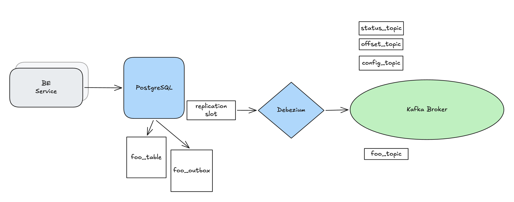
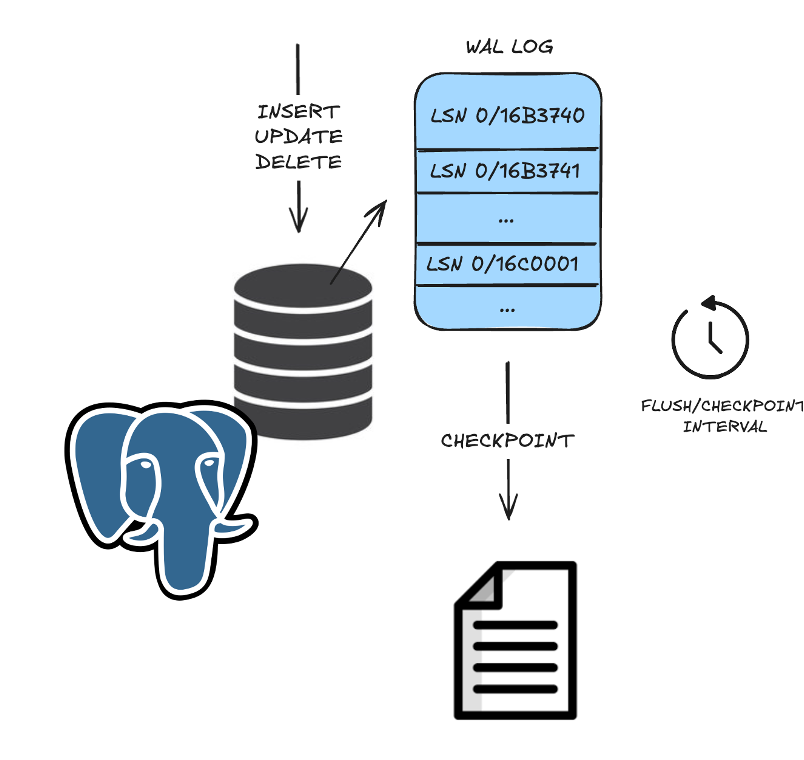
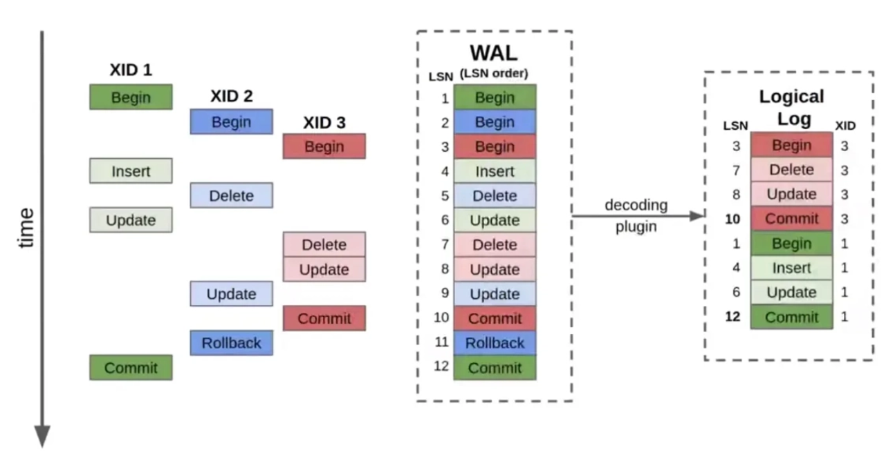
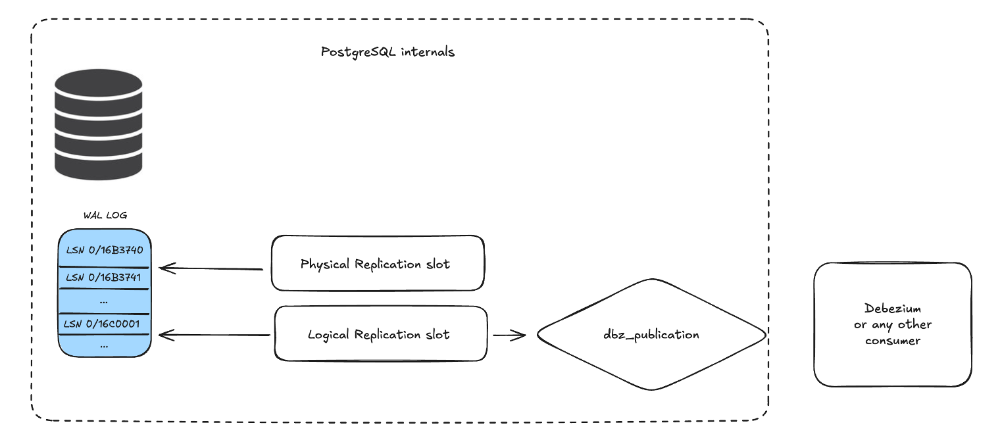
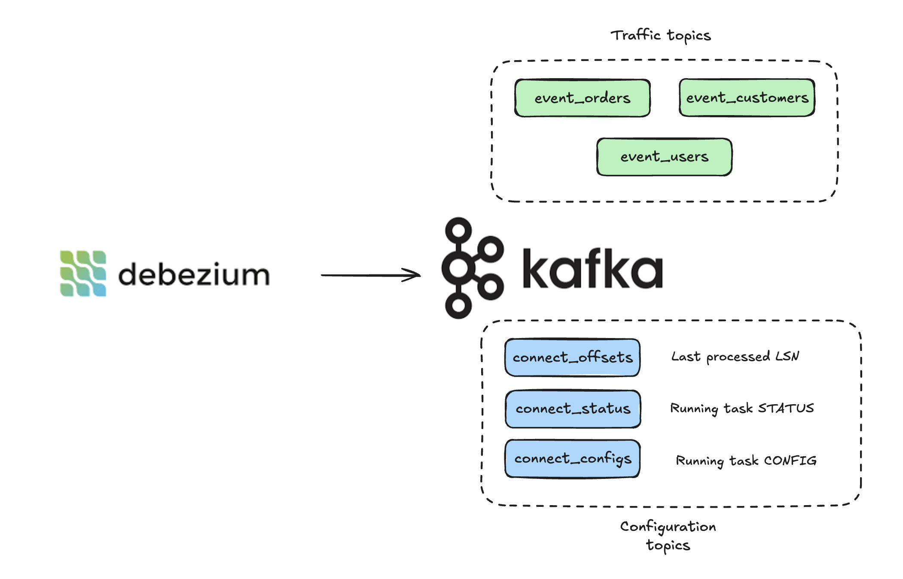
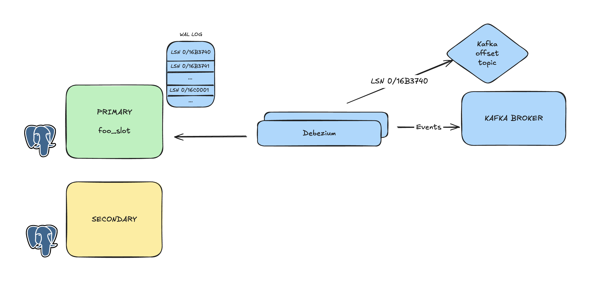
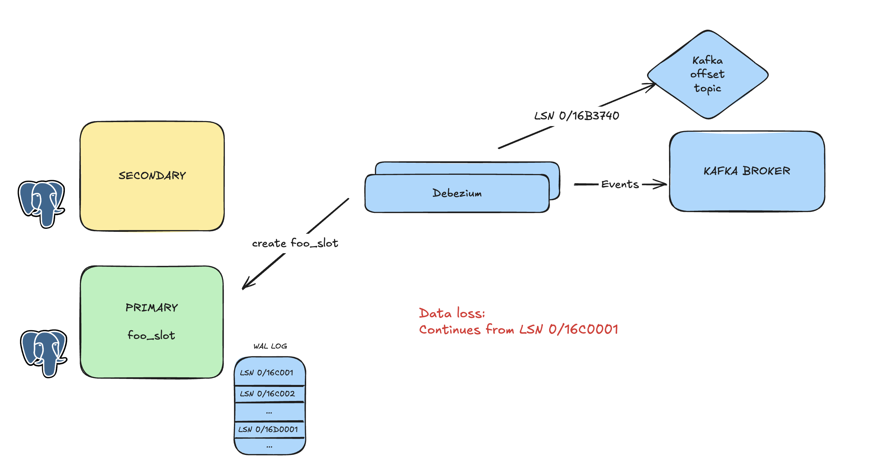
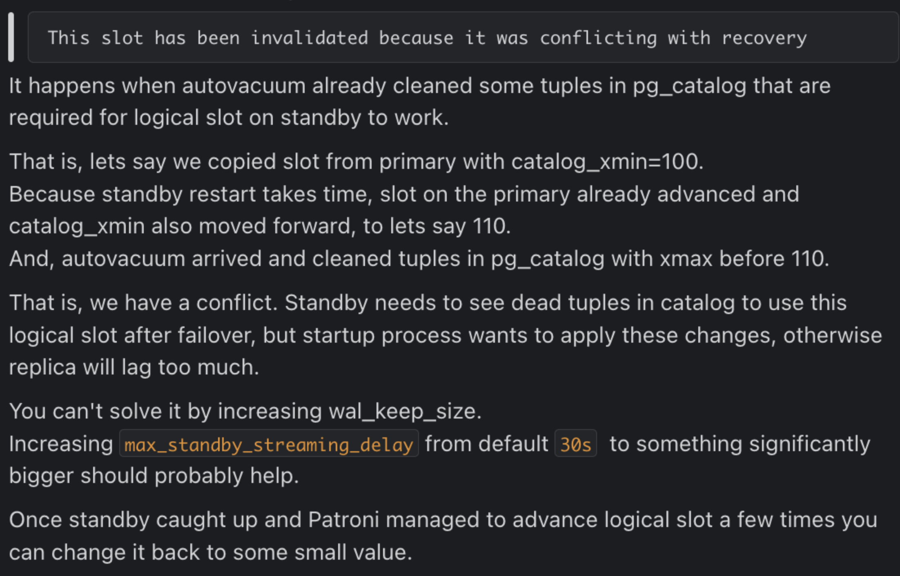

+++
title = 'Debezium and PostgreSQL in Production: Permanent replication slots'
date = '2026-08-10T17:00:00+02:00'
lastmod = '2026-08-10T17:00:00+02:00'
draft = true
description = 'What PostgreSQL replication slots taught us about operating Debezium a HA production environment.'
categories = ['Distributed Systems']
tags = ['Debezium', 'PostgreSQL', 'Kafka Connect', 'CDC']
toc = true
+++

Getting Debezium to stream the first PostgreSQL change into Kafka is straightforward. Operating that pipeline through database failover, quiet source tables, busy databases, and connector failures is where the interesting work begins.

This post describes two problems we encountered while running a PostgreSQL change data capture pipeline in production:

- a promoted PostgreSQL replica did not have the logical replication slot Debezium expected, creating a risk of skipped events;
- a low-traffic captured table allowed unrelated WAL to accumulate, creating a risk of filling the database disk.

Both problems become much easier to reason about once the positions maintained by PostgreSQL and Debezium are treated as one distributed checkpoint.

## Why put Debezium between PostgreSQL and Kafka?

Short answer is to have a transaction-like experience from the moment you call persist/save/commit in your code till that change get's published to Kafka.

Our applications uses the transactional outbox pattern. A change on a particular table and an outbox record a representing the change are committed in the same transaction. Debezium subscribes to changes of the outbox table, receives them from PostgreSQL's write-ahead log (WAL), transforms into the event shape expected by consumers, and publishes to Kafka.



This removes the unsafe gap between committing a database transaction and separately trying to publish an event. A committed outbox row remains available for Debezium to read even if the connector or Kafka is temporarily unavailable.

There is no exactly-once guarantee of the pipeline. A crash can happen after an event is written to Kafka but before the corresponding source offset is durably recorded. Debezium can therefore replay an event. Consumers still need idempotency, since replay will duplicate already produced records.

## Knowledge prerequisite helper

Short knowledge refresher so it is easier to keep the mental model and terminology in place.

### WAL and LSN

PostgreSQL reads the relevant data page into memory (`shared buffers`). The page is modified in the memory and a corresponding WAL (`Write Ahead Log`) record is created. The WAL record is placed into WAL buffers and the corresponding page is marked as dirty with a page LSN (`Log Sequence Number`). The page LSN records which WAL entry corresponds to the page’s latest changes. Before that dirty page can be written to its table/index file, the corresponding WAL must be flushed to durable storage.



### `wal_level = logical`

Setting the wal_level from replica (default) to logical is mandatory change to support logical decoding for logical replication (requires full server restart).
WAL get's *additional information* (catalog snapshot, changes, transaction boundaries, etc.) so rows can be reconstructed as SQL changes.



As everything in life logical log comes with measurable cost. I won't go any deeper into this topic, allowing myself to start a blog series about WAL and it's inner workings.



### PostgreSQL cheat sheet

If you want to follow along and test the behavior of a PostgreSQL cluster v16 with Debezium and Kafka check out my [Github repo](https://github.com/FraneJelavic/postgres-debezium-playground).

Checking wal_level:
```sql
playground=# show wal_level;
 wal_level
-----------
 logical
(1 row)
```

Inspecting replication slots:
```sql
playground=# select slot_name, slot_type, active, restart_lsn, confirmed_flush_lsn from pg_replication_slots;
    slot_name    | slot_type | active | restart_lsn | confirmed_flush_lsn
-----------------+-----------+--------+-------------+---------------------
 playground_slot | logical   | t      | 0/4680EE0   | 0/4680EE0
 postgres1       | physical  | t      | 0/4689438   |
 postgres3       | physical  | t      | 0/4689438   |
(3 rows)
```

Show publications:
```sql
playground=# select * from pg_publication;
  oid  |        pubname         | pubowner | puballtables | pubinsert | pubupdate | pubdelete | pubtruncate | pubviaroot
-------+------------------------+----------+--------------+-----------+-----------+-----------+-------------+------------
 16416 | playground_publication |       10 | f            | t         | t         | t         | t           | f
(1 row)
```

Show tables in publication:
```sql
playground=# select pubname, schemaname, tablename, attnames from pg_publication_tables where pubname = 'playground_publication';
        pubname         | schemaname |     tablename      |                                   attnames
------------------------+------------+--------------------+-------------------------------------------------------------------------------
 playground_publication | app        | outbox_events      | {id,correlation_id,aggregate_type,aggregate_id,event_type,payload,created_at}
 playground_publication | app        | debezium_heartbeat | {id,updated_at,connector_name}
(2 rows)
```

### Debezium as a consumer

Debezium connects to the Kafka broker and uses "special" topics for configuration. Image is worth a thousand words so here is one scatch:




**Debezium offset.** Debezium stores its last processed source position in Kafka's Connect offset topic. After a restart, it uses that offset to decide where to resume.

e.g.
```bash
f43d6d5d0703:/$ /opt/kafka/bin/kafka-topics.sh --bootstrap-server localhost:9092 --list
__consumer_offsets
playground.events.orders
playground.events.customers
playground.events.users
playground_connect_configs
playground_connect_offsets
playground_connect_statuses

$ /opt/kafka/bin/kafka-console-consumer.sh --bootstrap-server localhost:9092 \
     --topic playground_connect_offsets --from-beginning
{"lsn_proc":72030496,"messageType":"COMMIT","lsn_commit":72030496,"lsn":72030496,"txId":781,"ts_usec":1786272383341029}
{"lsn_proc":72053120,"messageType":"UPDATE","lsn_commit":72042784,"lsn":72053120,"txId":793,"ts_usec":1786272524880353}
...
```

For a healthy pipeline, these positions move in the same direction:

```text
PostgreSQL generates WAL
      └─ logical slot exposes changes
            └─ Debezium streams & decodes
                  ├─ advances slot's LSN → PG recycles older WAL
                  └─ commits source offset to Kafka topic (every 60s by default)
```

The positions are not identical at every instant. Reading PostgreSQL, producing to Kafka, and persisting an offset happen at different speeds. The important invariant is that WAL needed after the last durable Debezium offset remains available. Replaying from an older position can produce duplicates; starting from a newer position can lose events.

## Event loss scenario

Logical replication slots are not available on the standbys. Postgres 17 introduced synchronized failover slots.



After a replica get's promoted, Debezium connects to the new primary and does not find the logical slot.
Debezium creates a replacement slot. PostgreSQL created it at a position (LSN) available at that moment. That position is **newer** than the LSN stored in the Kafka Connect offset topic, equaling **data loss**.



### Patroni Solution, permanent replication slots

[Alexander Kukushkin (The Patroni guy)](https://github.com/cyberdem0n) in a [podcast](https://www.youtube.com/watch?v=SllJsbPVaow) with [Nikolay Samokhvalov](https://github.com/NikolayS) explains how he solved the problem in Patroni with permanent replication slots feature.

**TLDV** Patroni implementation does the following:
- Uses **fsync** (forces flush to disk on the OS level) to copy the replication slot from `$PGDATA/pg_replslot/slot_name`
    - requires a superuser or rewind_user to copy files
    - replication slot has a size of 200 bytes and fits into a single OS page
    - a restart of standy nodes is needed for the replication slots to be created
    - uses pg_read_binary_file() function to copy the slot file if it is missing on the replica
- Utilizes Patroni **loop_wait** (default 10s) to call `pg_replication_slot_advance('slot_name', 'LSN_position')` and move the LSN on the replication slot forward to a specific position
- Automatically enables `hot_standby_feedback()` if it is not already enabled
- Uses replication slot after replica has been promoted to primary

**Potential problems**
- requested WAL segment `pg_wal/XXX` has been removed
- physical slot is behind logical slot (unlikely to happen)
    - physical slot did not reach the `catalog_xmin` transaction of the logical slot on the old primary (Patroni logs a WARN message that it might be unsafe to use)


**Configuration**

```yaml
$ patronictl edit-config
...
postgresql:
  use_slots: true (default)
  parameters:
    wal_level: logical
slots:
  playground_slot:
    database: postgres
    plugin: pgoutput
    type: logic
...
```
```bash
Apply these changes [y/n]: y
```

### [Zeno's paradox](https://en.wikipedia.org/wiki/Zeno%27s_paradoxes)

Bootstrapping this on an already busy cluster was significantly harder than enabling it on a new cluster.
Replicas needed to reboot in order to read the copied replication slot data. In a traffic intensive cluster reboots take significant amount of time.
Every attempt to configure permanent replication slots with replica reboot, resulted in creation of the logical slot with `wal_status = lost`.
```bash
This slot has been invalidated because it was conflicting with recovery.
```

I've reached out to Alexander and we brainstormed a little (posting a screenshot since PostgreSQL slack archived the conversation):



Zeno's paradox was catching the LSN that was already gone once the replica was up and running with premanent replication slot.

### Solution sweet spot

However, to enable the feature on a traffic intensive cluster and on tables Debezium is subscribed to, the following worked:

1. Create the corresponding logical slots on the replicas by hand
    - `pg_create_logical_replication_slot('slot_name', 'pgoutput')`
2. Align them with the safely acknowledged position on the primary
    - `pg_replication_slot_advance('slot_name', 'LSN/12345')`
3. Add the permanent-slot configuration to Patroni
4. Reload the configuration instead of restarting the database nodes
5. Patroni continues to monitor and advance slots without `ERROR`


#### *IMPORTANT NOTE:*
- This is not a copy-and-paste runbook.
- Slot synchronization capabilities differ between PostgreSQL versions and high-availability managers.
- If you are able upgrade PostgreSQL to v17 and above.
- Advancing a slot beyond the connector's durable offset can create exactly the gap the procedure is meant to prevent.
- The invariant to validate: after promotion, the new primary must still retain every WAL record Debezium may request.


## Takeaways

Debezium's happy path is only the beginning. Configuration gets complicated with HA demands in a cluster setup.\
PostgreSQL, Kafka Connect, and Kafka each maintain part of the pipeline's progress, and production correctness depends on how those checkpoints interact during failure.

Lessons learnt:

1. Treat the PostgreSQL slot and Debezium offset as one distributed checkpoint.
2. Prefer replay and idempotent consumption over any possibility of an LSN gap.
3. Make logical-slot continuity an explicit part of database failover design.
6. Test failure modes with real writes and position comparisons, not only process health.
