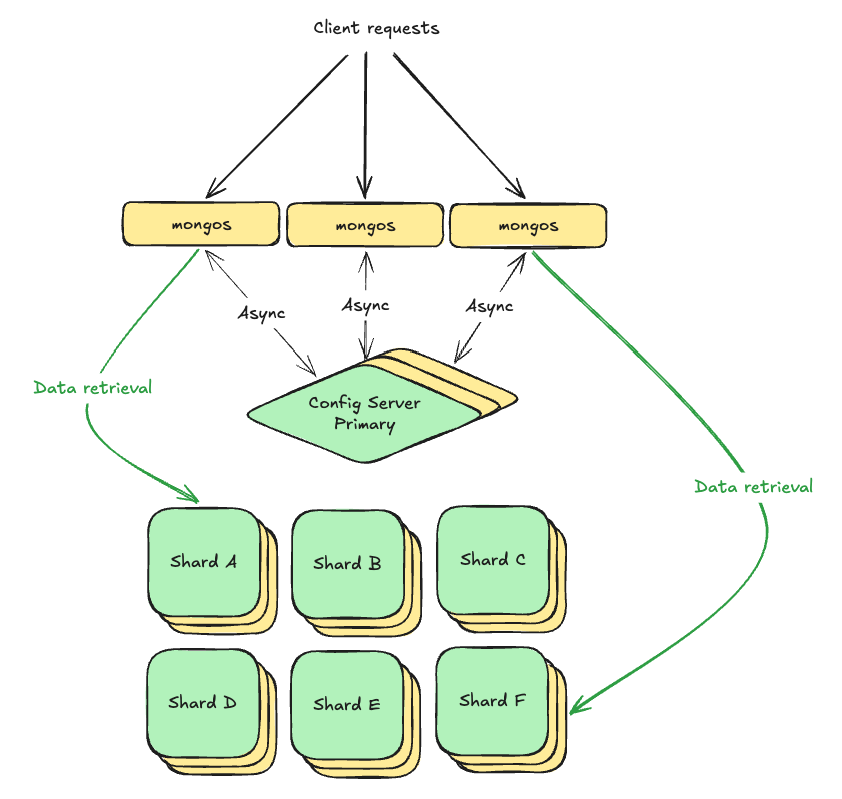
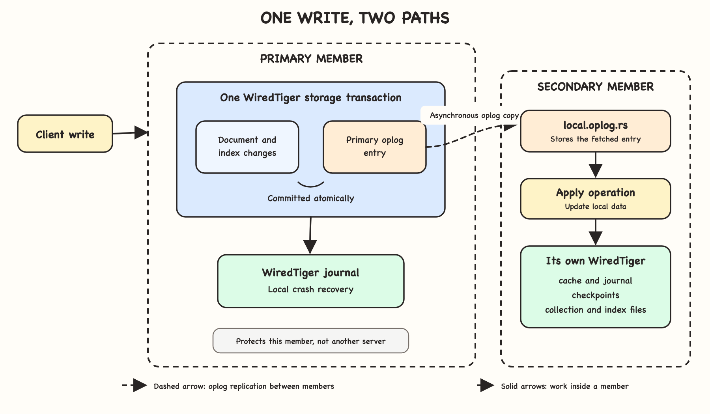

+++
title = 'MongoDB: One write two logs'
date = '2026-09-09T12:00:00+02:00'
lastmod = '2026-09-09T12:00:00+02:00'
draft = true
description = 'Following a write through MongoDB replication and WiredTiger local durability.'
categories = ['Databases']
tags = ['MongoDB', 'WiredTiger', 'Replication', 'Storage Engines']
toc = true
socialImage = ''
+++

> **A note on scope**
>
> This article records my current understanding of MongoDB and WiredTiger, built through hands-on operation and continued study. It is a **learning** document. I have tried to keep the technical details accurate, but any errors or oversimplifications are mine. [MongoDB official docs](https://www.mongodb.com/docs/manual/) and [WiredTiger documentation](https://source.wiredtiger.com/develop/index.html) should always be consulted for correctness and clarity.

## Baptism by fire

When I first encountered MongoDB, I tried to understand it through the database I knew best: PostgreSQL.

My journey was a *baptism by fire*. I was managing a sharded cluster with 20 TB of data and as many as ~55k operations per second, including ~29k writes. The cluster had six shards, each with its own replica set, a config server replica set, and six routers.

To operate that cluster safely, I had to stop treating MongoDB like PostgreSQL and learn how it worked internally.

At one point, while tackling a flow control problem on the stated cluster a recommendation from an AI model was: increase the portion of memory assigned to the WiredTiger cache. At the moment the recommendation sound genuine and correct, but I did not know what the model has based its conclusions off. To be completely honest, neither did I know how RAM is used by MongoDB. The nail in the coffin was the [official docs](https://www.mongodb.com/docs/manual/core/wiredtiger/#memory-use) saying don't change WiredTiger cache to RAM ratio.

That experience clarified why I wanted to learn the internals. I want/need enough understanding to connect operational advice to a mechanism, identify the evidence it depends on, and decide. This applies whether the advice comes from AI, a colleague, documentation, or my own assumptions.

What happens after a MongoDB client sends a write?

How does that write pass through MongoDB and WiredTiger, and when does it become durable on disk?

And when someone recommends changing a WiredTiger setting, what would have to be true for that recommendation to make sense?

## Following one write

When a client sends a write operation to a sharded cluster, the request first reaches a router called `mongos`. Routers cache data from the config server about chunk - shard placements. Using this data `mongos` determine which shard owns the relevant data and forward the operation to that shard's primary node.



However, this post does not compare replica sets and sharded clusters. Once routing is complete, the same question applies inside every shard.

How does the primary `mongod` process request, persist it, and replicate it to secondary nodes?

## Separation of concern

To answer my question(s), I firstly had to understand where `mongod` ends and the storage engine `WiredTiger` begins.

`mongod` handles client commands, authorization, query execution, transaction coordination, and replication. WiredTiger is the embedded storage engine that stores collection and index data. It provides local transactions, MVCC, caching, compression, journaling, checkpoints, and crash recovery.

```text
MongoDB client
      │ write operation
      ▼
mongos query router
      │ routes to the owning shard
      ▼
shard primary (mongod)
      ├── authorization and command handling
      ├── query parsing and execution
      ├── transaction and session coordination
      ├── replication and oplog coordination
      └── storage-engine API
                  │
                  ▼
             WiredTiger
                  ├── local transactions and MVCC
                  ├── internal cache
                  ├── journal
                  ├── checkpoints
                  └── collection and index data in dbPath
```

Ok, but how does this come to play? Boundaries are not absolute.
The oplog, belongs to MongoDB's (logical) replication model, but WiredTiger stores it alongside other collection data.

## One write, two logs

At this point, I had another question. If MongoDB already has a `journal`, why does it also need an oplog?

The WiredTiger journal is the closest equivalent to PostgreSQL's WAL (Write Ahead Log). It records the changes needed to recover **one** MongoDB member (*keep this thought*) after a crash. Unlike PostgreSQL's WAL, MongoDB does not use the journal as its replication stream.

The `oplog` has a different purpose. It is a capped collection stored in the `local` database as `local.oplog.rs`. Secondary members copy its entries and apply them to their own data.

This raises an important consistency question. What prevents MongoDB from committing a document change without its corresponding oplog entry?



### Data folder

Let's examine what happens on one node and then additionally complicate the story by adding secondaries.

To understand local durability, I first looked inside the `dbPath` of a MongoDB member. A simplified listing:

```bash
$ ls /data/mongodb/
collection-<ident>.wt
index-<ident>.wt
journal/
WiredTiger
WiredTigerHS.wt
WiredTiger.lock
WiredTiger.turtle
WiredTiger.wt
```

The exact files and their names depend on the MongoDB version and configuration, but these are the main WiredTiger files relevant to this discussion.

The `collection-<ident>.wt` and `index-<ident>.wt` files are WiredTiger tables that store collection records and index entries.

MongoDB's durable catalog maps logical objects, such as a collection namespace, to these storage-engine identifiers. WiredTiger maintains its own metadata in `WiredTiger.wt`, including its tables, their configuration, and their latest checkpoints.

The small `WiredTiger` text file identifies the WiredTiger version used to create the database:

```text
WiredTiger
WiredTiger 10.0.2: (November 30, 2021)
```

`WiredTigerHS.wt` is the history store. It keeps older committed versions of records needed by MVCC readers, snapshots, etc. WiredTiger removes versions once no active reader or snapshot can require them.

`WiredTiger.turtle` contains enough metadata to locate and open the latest checkpoint of `WiredTiger.wt`. It bootstraps the metadata table during startup and recovery.

```text
WiredTiger version string
WiredTiger 10.0.2: (November 30, 2021)
WiredTiger version
major=10,minor=0,patch=2
file:WiredTiger.wt
...
checkpoint_lsn=(2248,16291200)
...
```

The `checkpoint_lsn` identifies a position in the WiredTiger journal using a log file number and byte offset. During recovery, WiredTiger opens the last consistent checkpoint and replays later journal records.

The `journal/` directory contains those write-ahead log files. They protect changes made after the last checkpoint from being lost during an unexpected shutdown.

Finally, `WiredTiger.lock` is the file on which WiredTiger acquires a lock to prevent two processes from opening the same database directory simultaneously. The lock state matters, not merely the existence of the file.

### The WiredTiger cache

WiredTiger does not modify the `collection-*.wt` and `index-*.wt` files directly for every client operation. It first reads the required pages into its internal cache and applies the change there as part of a storage transaction. Modified pages become dirty until WiredTiger reconciles and writes them to disk.

This internal cache keeps uncompressed collection data and is separate from the operating system's filesystem cache where compressed data is stored.

MongoDB therefore benefits from **both caches**, WiredTiger and the OS cache.

Giving all available memory to the WiredTiger cache would leave too little memory for the filesystem cache and the rest of `mongod` and respecting the default, `max((availRAM - 1024) x 0.5, 256 MB)`, is strongly advised by [the official docs.](https://www.mongodb.com/docs/manual/core/wiredtiger/#memory-use)

This is already enough to show why "increase the WiredTiger cache" is incomplete advice. A larger cache does not create memory. It transfers memory away from the filesystem cache and other allocations. Whether that trade is useful depends on the workload and the source of the observed pressure.

When the cache approaches its limits, WiredTiger evicts pages to make room. Clean pages can be discarded and read again later. Dirty pages must first be reconciled into an on-disk representation.

A committed change does not have to wait for its dirty page to reach the collection file. The journal supplies durability between checkpoints. This separation is the reason a write can be durable even though its final data page is still dirty in memory.

### Recovering after a crash

In case of a crash, WiredTiger starts from the last complete checkpoint. The checkpoint metadata identifies a consistent view of the WiredTiger tables and the journal position associated with it.

WiredTiger then replays the journal records created after that checkpoint. At a high level, recovery combines two inputs:

```text
last complete checkpoint + later durable journal records = recovered local state
```

### Checkpoints and data files

WiredTiger normally creates a checkpoint every (configurable default) 60 seconds. A checkpoint can take longer when there is more dirty data or the storage device is under pressure.

During a checkpoint, WiredTiger writes a point-in-time view of dirty pages to the collection, index, history-store, and metadata files.

```text
WiredTiger transaction
        │
        ├── dirty pages in cache ──checkpoint──▶ .wt data files
        │
        └── journal records ───────────────────▶ journal files

                         crash
                           │
                           ▼
       latest checkpoint + subsequent journal records
                           │
                           ▼
                    recovered state
```

### How the primary records an operation

For an incoming query `mongod` will, among other things, determine collection and index changes and construct the oplog logical entry.
It uses WiredTiger to start/use a transaction and
either commits both parts or commits neither. This prevents a successful document change from existing on the primary without an operation (oplog entry) that secondaries can replicate.

The oplog entry contains an operation type, namespace, timestamp, and the data required to reproduce the change. Its timestamp provides an ordering position in the replica-set history. The entry describes a logical insert, update, delete, command, or transaction operation rather than the low-level page modifications stored in the WiredTiger journal.

```bash
rs_a [direct: primary] local> db.oplog.rs.findOne()
{
  ts: Timestamp(...),
  t: NumberLong(...),
  op: "u",
  ns: "foo.bar",
  o: { $v: 2, diff: { ... } },
  o2: { _id: 123 }
}
```

This is not a complete definition of how oplog and collection changes work but the important invariant is: **the primary commits the replicated data changes together with the oplog records which describe them.**

Only the local commit is atomic. Sending or copying the oplog entry across the network is not part of that storage transaction.

### How secondaries copy and apply oplog entries

Each secondary continuously selects a sync source and streams newer oplog entries from it. The sync source is often the primary.

The secondary writes fetched entries to its own oplog and then applies the represented operations to its local collections and indexes.

Secondary's uses it's own WiredTiger instance to apply changes. They modify its cache, produce local journal records, and later become part of its checkpoints.

This is the important distinction and the answer why we can't just ship primaries `*.wt` binaries to the secondary.
On two MongoDB servers these are different files.

### Oplog versus journal

| Property | Oplog |  Journal |
|---|---|---|
| Layer | MongoDB | WiredTiger |
| Purpose | Replication | Crash recovery |
| Contents | Logical MongoDB operations | Storage-engine recovery records |
| Consumed by | Secondary nodes | WiredTiger during startup/recovery |
| Scope | ReplicaSet logical history | One server only |
| Replicated? | Yes, logically | No |


### Takeaways

This gives a practical sequence for evaluating operational changes:

1. Identify which component owns the behavior
2. Describe the mechanism that is a cause of the problem
3. Find evidence supporting that mechanism
4. Clarify what should be the improvements
5. Measure
6. Iterate

The technical facts in this article support that way of reasoning:

- The WiredTiger journal and the oplog solve different problems. The journal recovers one member; the oplog replicates logical operations between members.
- MongoDB commits a replicated data change and its oplog entry in the same local storage transaction on the primary.
- A durable change can still exist as a dirty cache page because the journal protects it between checkpoints.
- Primaries and secondaries have separate WiredTiger databases, caches, journals, and data files.
- Memory assigned to WiredTiger is part of a larger allocation decision that includes the filesystem cache and other process memory.


## Why I wanted to understand this

Learning how WiredTiger works does not mean that I can derive every production decision from first principles. It gives me a way to examine a recommendation instead of accepting it because the source sounds confident and we all know AI can sound like that.

The quality of an (AI) recommendation depends on the question and the evidence supplied to it.


## Further reading

- [MongoDB manual: WiredTiger storage engine](https://www.mongodb.com/docs/manual/core/wiredtiger/)
- [MongoDB manual: Journaling](https://www.mongodb.com/docs/manual/core/journaling/)
- [MongoDB manual: Replica set oplog](https://www.mongodb.com/docs/manual/core/replica-set-oplog/)
- [MongoDB manual: Replica set synchronization](https://www.mongodb.com/docs/manual/core/replica-set-sync/)
- [MongoDB source documentation: Storage engine](https://github.com/mongodb/mongo/blob/master/src/mongo/db/storage/README.md)
