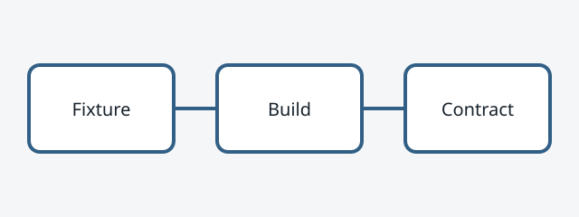
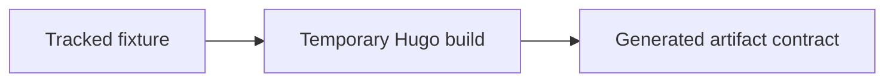

+++
title = "Validation Fixture: Feature Article"
date = 2026-07-15T09:30:00+02:00
lastmod = 2026-07-16T10:45:00+02:00
draft = false
description = "Synthetic feature article used only by deterministic build validation."
categories = ["Validation Category"]
tags = ["Validation Tag", "Deterministic Checks"]
toc = true
socialImage = "diagram.svg"
+++

VALIDATION-FIXTURE-DO-NOT-PUBLISH: This synthetic article exercises the technical-writing contract.

## Fixture architecture

The fixture verifies stable generated markup and links to the [Writing archive](/writing/). It also includes an [external validation reference](https://example.com/validation "External validation reference").

### Highlighted query

```sql
SELECT validation_state
FROM synthetic_checks
WHERE deterministic = TRUE;
```

### Wide result table

| Scenario | Published | Draft | Future | Expired |
|---|---:|---:|---:|---:|
| Fixed clock | 2 | 0 | 0 | 0 |

### Bundle image



### Conditional diagram


